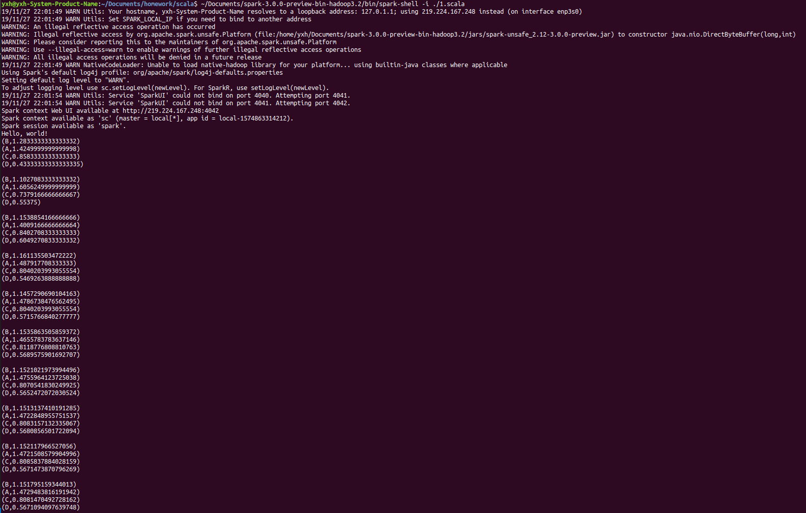

#PageRank作业
##源码和注释
```
println("Hello, world!") // 输出 Hello World
var links=sc.parallelize(Array(("A",List("B","C","D")),("B",List("A")),("C",List("A","B")),("D",List("B","C"))),1)//sparkcontext 生成spark并行数据集sparkcontext
var ranks=links.mapValues(x=>1.0)//用links的键值生成map，值为1.0
links.first
ranks.first
for(i <- 1 to 10)
{
    
    val join1=links.join(ranks)
    /*join按键值合并links和ranks，i=1时生成
    (B,(List(A),1.0))
    (A,(List(B, C, D),1.0))
    (C,(List(A, B),1.0))
    (D,(List(B, C),1.0))*/
    val contribsRdd = join1.flatMap{
        case(srcURL, (link, rank)) => link.map(destURL => (destURL, rank / link.size))}
    /* destUTL代表link中某一个元素如B
    case模式匹配将join1的map分解为三部分，其中link=List("B","C","D")+List....
    link.map(destURL => (destURL, rank / link.size))输出，
    (A,1.0)
    (B,0.3333333333333333)
    (C,0.3333333333333333)
    (D,0.3333333333333333)
    (A,0.5)
    (B,0.5)
    (B,0.5)
    (C,0.5)*/
    ranks = contribsRdd.reduceByKey(_ + _).mapValues(0.15 + _ * 0.85)
    /*_ + _就是(x,y) => x+y
    寻找相同key的数据，当找到这样的两条记录时会对其value(分别记为x,y)做(x,y) => x+y的处理，即只保留求和之后的数据作为value。反复执行这个操作直至每个key只留下一条记录。*/
    ranks.take(4).foreach(println)//获取RDD中从0到3下标的元素（不排序）并输出
    println()//换行，便于观察
}
ranks.saveAsTextFile("ranks")//保存在ranks文件夹下
```
##结果截图
